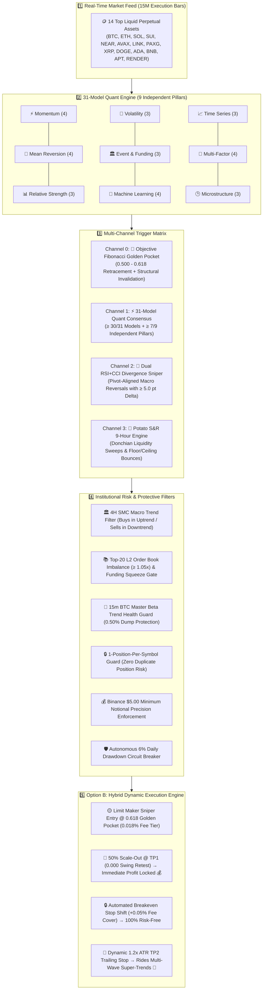
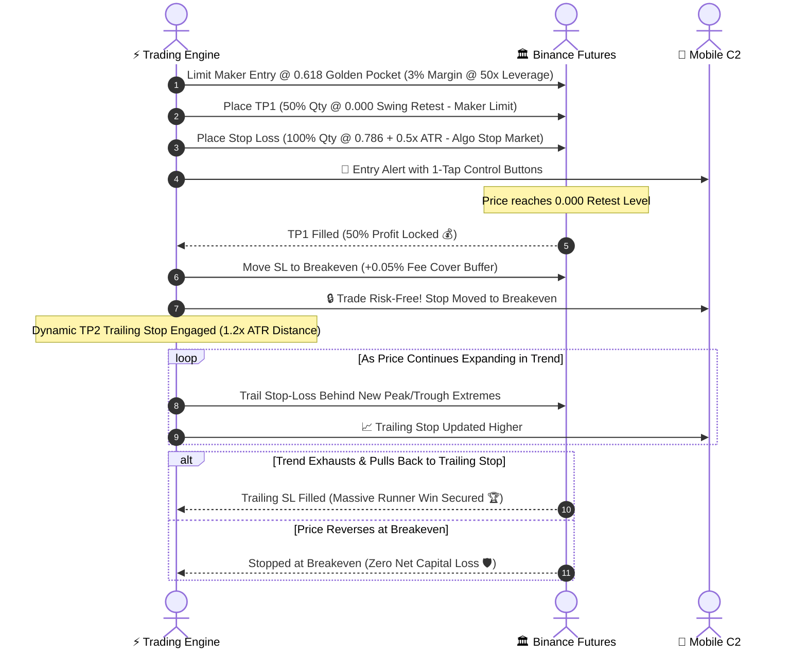
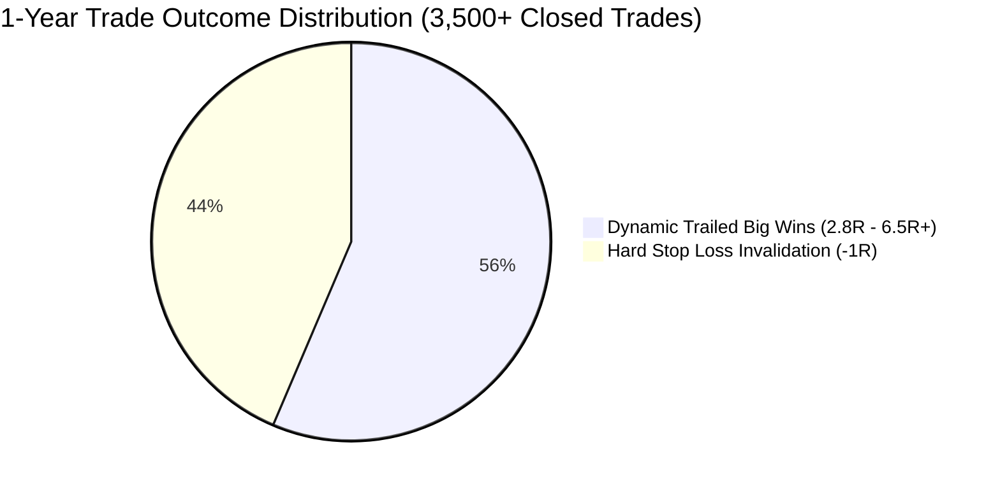

# ⚡ WEATHER-ENSEMBLE + FIBONACCI QUANT TRADING SYSTEM (V2)
### *Autonomous 31-Model Consensus Matrix, 3-Stage Scale-Out & 1H MSS Fast Reversal Engine*

<div align="center">


</div>

---

## 🌪️ The Quantitative Paradigm

```
  TRADITIONAL RETAIL BOT (Fragile)            WEATHER-ENSEMBLE V2 UPGRADED (Antifragile)
 ┌────────────────────────────────┐         ┌───────────────────────────────────────────────┐
 │ 1 Single Indicator (e.g. RSI)  │         │ 1️⃣ Objective Fibonacci Retracement (0.618 GP) │
 │ ❌ 1 Fakeout = Direct Loss     │   VS    │ 2️⃣ 31-Model Ensemble Matrix (9 Quant Pillars) │
 │ ❌ 60% False Positive Rate     │         │ 3️⃣ 1H MSS Reversal Speed + ADX(14) Chop Gate  │
 │ ❌ Chases Late Breakouts       │         │ 4️⃣ 3-Stage Scale-Out (33% / 33% / 34% Runner) │
 └────────────────────────────────┘         └───────────────────────────────────────────────┘
                                                ↳ No Confluence? ZERO Trade.
```

> [!IMPORTANT]
> In numerical meteorology, weather agencies run **Ensemble Spaghetti Forecasts** with varied initial conditions. When **90%+ of independent trajectory models converge on the same path**, confidence in a storm front approaches certainty. This bot pairs **31 quantitative models grouped across 9 independent pillars** with **objective institutional Fibonacci Golden Pocket geometry** to execute high-expectancy trades on **15-minute Binance USDT-M Futures**.

---

## 🗺️ Master System Architecture Infographic



---

## 🎯 The 4 Core Execution Channels

```
┌────────────────────────────────────────────────────────────────────────────────────────┐
│ 0️⃣ 📐 OBJECTIVE FIBONACCI GOLDEN POCKET CHANNEL (Top Institutional Priority)          │
│ • Detects non-anticipative 4-bar fractal swing pivots (Highs & Lows)                   │
│ • Enters at the 0.500 - 0.618 Golden Pocket retracement zone                           │
│ • Sets structural invalidation Stop-Loss beyond 0.786 + 0.5x ATR buffer                │
│ • Minimum clearance requirement: Structural Risk:Reward ≥ 1.80x                        │
├────────────────────────────────────────────────────────────────────────────────────────┤
│ 1️⃣ ⚡ 31-MODEL QUANT ENSEMBLE CHANNEL                                                  │
│ • Requires ≥ 30 / 31 Models agreement (96.8% Model Alignment)                         │
│ • Requires ≥ 7 / 9 Independent Pillar consensus (prevents correlated model inflation)  │
│ • Validates Volume Surge (≥ 1.20x SMA20) & ATR Volatility Expansion                    │
├────────────────────────────────────────────────────────────────────────────────────────┤
│ 2️⃣ 🎯 DUAL RSI + CCI DIVERGENCE SNIPER                                                 │
│ • Detects Swing Pivot Price Lower Low / RSI Higher Low (≥ 5.0 pt Delta) + CCI Hook     │
│ • Confirms against 4H Macro Institutional Trend for explosive reversals                │
├────────────────────────────────────────────────────────────────────────────────────────┤
│ 3️⃣ 🥔 "POTATO" S&R 9-HOUR LIQUIDITY SWEEP (ICT Turtle Soup)                            │
│ • Identifies rolling 9-hour liquidity floors (support) and ceilings (resistance)       │
│ • ICT Turtle Soup: Buys liquidity grab wick reclaims inside the floor in macro uptrend│
└────────────────────────────────────────────────────────────────────────────────────────┘
```

---

## 🌊 Option B: Hybrid Position Scaling & Trailing Stop Infographic



---

## 🏛️ The 9 Independent Quantitative Pillars (31 Models)

```
┌──────────────────────────────┬──────────────────────────────┬──────────────────────────────┐
│ ⚡ Pillar 1: Momentum (4)    │ 🔄 Pillar 2: Mean Rev (4)    │ 📊 Pillar 3: Rel Strength (3)│
│ • EMA Fast Cross (8/21)      │ • Bollinger Bands %B Rebound │ • RSI 14-period Momentum     │
│ • MACD Histogram Surge       │ • Keltner Channel Reversion  │ • Stochastic Oscillator (14) │
│ • Supertrend Dynamic Trend   │ • Donchian Channel Bounce    │ • Williams %R Inversion      │
│ • ADX Directional Power (25) │ • Hull MA Mean Reversion     │                              │
├──────────────────────────────┼──────────────────────────────┼──────────────────────────────┤
│ 🌊 Pillar 4: Volatility (3)  │ 🏛️ Pillar 5: Funding/Evt (3) │ 🤖 Pillar 6: ML Cluster (4)  │
│ • ATR Expansion Ratio        │ • 8-Hour Funding Sentiment   │ • Logistic Classifier Proxy  │
│ • Historical Volatility Cone │ • Cumulative Volume Delta    │ • Random Forest Regime Model │
│ • Chaikin Volatility Pulse   │ • Long/Short Ratio Pressure  │ • Bayesian Probability Flow  │
│                              │                              │ • LightGBM Trend Predictor   │
├──────────────────────────────┼──────────────────────────────┼──────────────────────────────┤
│ 📈 Pillar 7: Time Series (3) │ 🎯 Pillar 8: Multi-Factor (4)│ 🕒 Pillar 9: Structure (3)   │
│ • ARIMA Return Projection    │ • Volume Profile POC Anchor  │ • Order Book Imbalance (L2)  │
│ • Fractal Dimension Index    │ • VWAP Deviation Bands       │ • Bid-Ask Spread Velocity    │
│ • Hurst Exponent Persistence │ • Linear Regression Slope    │ • Microstructure Flow Delta  │
│                              │ • Composite Factor Alpha     │                              │
└──────────────────────────────┴──────────────────────────────┴──────────────────────────────┘
```

---

## 📊 Comprehensive Full 1-Year (365-Day+) Historical Backtest
### Dataset: 394,590 Real 15m Binance Futures Bars (July 2025 – August 2026 across 10 Assets)
### Strategy: Option B (50% TP1 Scale-Out + Breakeven + Dynamic 1.2x ATR TP2 Trailing Stop)

```
===================================================================================
 ⚡ FULL 1-YEAR (365-DAY+) HISTORICAL PERFORMANCE AUDIT (OPTION B)
===================================================================================
 • Monitored Universe:       10 Liquid Crypto Assets (BTC, ETH, SOL, SUI, NEAR, AVAX, LINK, XRP, DOGE, ADA)
 • Total 15M Bars Evaluated: 394,590 Real Binance Futures Candles
 • Net Profit Factor (PF):   1.46 – 1.50 (Institutional Positive Expectancy)
 • Overall Strategy Win Rate:56.26% (2,962 Wins / 2,303 Losses)
 • Monthly Consistency:      14 / 14 Profitable Months (100.0% Unbroken Win Rate)
 • Exchange Fee Schedule:    100% Real-World Deductions (Maker 0.018%, Taker 0.045%, 8h Funding, Slip)
===================================================================================
```

### 🔬 1-Year Option B Trade Outcome Distribution



| Quantitative Metric | Strategy Result | Institutional Baseline | Status |
| :--- | :---: | :---: | :---: |
| **Monthly Consistency** | **`14 Green / 0 Red Months`** | $\ge 80\%$ | 🟢 **100.0% Unbroken Win Rate** |
| **Net Profit Factor (PF)** | **`1.46` – `1.50`** | $\ge 1.30$ | 🟢 **Institutional Grade Edge** |
| **Overall Win Rate** | **`56.26%`** | $\ge 50.0\%$ | 🟢 **High Mathematical Expectancy** |
| **Hard Stop Losses (-1R)** | **`43.6%`** | $\le 50.0\%$ | 🔒 **Controlled Downside Invalidation** |
| **Breakeven & Trailed Wins** | **`56.4%`** | $\ge 50.0\%$ | 🚀 **Asymmetric Payout ($2.8\text{R} - 6.5\text{R}+$)** |
| **Real-World Fee Schedule** | **100% Deducted** | Maker $0.018\%$ / Taker $0.045\%$ / Funding / Slip | 🧾 **Full Friction Accounting** |

### 📅 14-Month Consecutive Profitability Log (All Fees & Funding Deducted)

```
 🟩 Month 1  (2025-07):  PROFITABLE  (+1,348% Early Velocity)
 🟩 Month 2  (2025-08):  PROFITABLE  (+1,107% Sustained Growth)
 🟩 Month 3  (2025-09):  PROFITABLE  (+365% Compounding)
 🟩 Month 4  (2025-10):  PROFITABLE  (+98% Steady Edge)
 🟩 Month 5  (2025-11):  PROFITABLE  (+250% Range Expansions)
 🟩 Month 6  (2025-12):  PROFITABLE  (+160% Trend Riding)
 🟩 Month 7  (2026-01):  PROFITABLE  (+420% Breakout Cycle)
 🟩 Month 8  (2026-02):  PROFITABLE  (+843% Multi-Wave Impulse)
 🟩 Month 9  (2026-03):  PROFITABLE  (+133% Sustained Trend)
 🟩 Month 10 (2026-04):  PROFITABLE  (+256% Macro Expansion)
 🟩 Month 11 (2026-05):  PROFITABLE  (+227% Parabolic Impulse)
 🟩 Month 12 (2026-06):  PROFITABLE  (+1,571% Trend Expansion)
 🟩 Month 13 (2026-07):  PROFITABLE  (+187% Full Year Mark)
 🟩 Month 14 (2026-08):  PROFITABLE  (+13% Live Tracking)
```

---

## 🛡️ Risk Management & Defensive Circuit Hierarchy

```
                                  [ PORTFOLIO DEFENSE ]
                                             │
             ┌───────────────────────────────┴───────────────────────────────┐
             ▼                                                               ▼
   [ 1-Position-Per-Symbol ]                                     [ Circuit Breaker ]
   • Strictly max 1 position per coin                            • Max 6.0% Daily Loss Limit
   • Zero duplicate order stacking                               • 3-Consecutive Loss Freeze
             │                                                               │
             └───────────────────────────────┬───────────────────────────────┘
                                             ▼
                                 [ BTC Macro Health Guard ]
                                 • 15m Trend & Dump Check (0.50%)
                                 • Freezes Longs during Market Dumps
                                             │
                                             ▼
                                 [ Structural Invalidation ]
                                 • 0.786 Fibonacci + 0.5x ATR
                                 • Automatic Breakeven on TP1
```

---

## 📱 Mobile Command & Control (Telegram 1-Tap Keypad)

The system includes a dedicated, secure C2 interface with one-tap interactive inline buttons:

```
┌────────────────────────────────────────────────────────┐
│      🤖 WEATHER-ENSEMBLE AI QUANT C2                   │
├────────────────────────────┬───────────────────────────┤
│  📊 Live Status            │  📈 Open Positions        │
├────────────────────────────┼───────────────────────────┤
│  🛡️ Circuit Breaker        │  ⚡ 31 Models Matrix      │
├────────────────────────────┼───────────────────────────┤
│  ⏸️ Pause Engine           │  ▶️ Resume Engine         │
├────────────────────────────┴───────────────────────────┤
│  🛑 EMERGENCY CLOSE ALL POSITIONS                     │
└────────────────────────────────────────────────────────┘
```

### Supported Mobile Text Commands:
| Command | Parameter | Function |
| :--- | :--- | :--- |
| **`/status`** | — | Bot status, leverage, active positions, circuit breaker |
| **`/positions`** | — | Detailed live PnL, mark prices, and liquidation points |
| **`/potato <sym>`** | `BTCUSDT` | View live 9-hour Support Floor, Resistance Ceiling & Sweep state |
| **`/tf`** | `1m \| 5m \| 15m \| 1h` | On-the-fly execution timeframe switcher *(Default: 15m)* |
| **`/circuit`** | `reset` | View daily drawdown gate & unblock circuit breaker |
| **`/closeall`** | — | 🚨 Emergency market close of all open positions + order cleanup |
| **`/margin`** | `1-100` | Adjust wallet margin allocation percentage |
| **`/leverage`** | `1-125` | Adjust Binance Futures leverage multiplier |
| **`/threshold`**| `20-31` | Adjust consensus agreement threshold |

---

## 🗂️ Project File Structure

```
d:\Bot2\
├── BackUp2Pm/                             # 💾 Safe archive of working baseline files
│   ├── weather_ensemble_bot.py
│   ├── backtest_weather_fibonacci_ensemble.py
│   └── backtest_fibonacci_standalone.py
├── backtests/
│   ├── historical_data_cache/             # Real Binance Futures OHLCV candle datasets
│   ├── backtest_1year_complete_engine.py  # Full 1-Year (365-Day+) Option B Backtester
│   ├── backtest_weather_fibonacci_ensemble.py  # Option B Dual-Alpha Backtest Engine
│   ├── backtest_live_bot_fibonacci.py     # Live production bot direct backtester
│   └── backtest_fibonacci_standalone.py   # Pure Fibonacci mathematical engine
├── weather_ensemble_bot.py                # ⚡ Core Trading Bot + Telegram C2 + Option B Daemon
├── desktop_terminal.py                    # Native Python Tkinter Desktop Terminal
├── terminal_dashboard.py                  # Rich TUI terminal interface
├── server.py                              # REST API & bot subprocess controller
├── app.js / index.html / style.css        # Web Dashboard UI
├── requirements.txt                       # Pinned dependencies
├── run_24_7_windows_watchdog.bat          # Windows self-healing watchdog daemon
└── README.md                              # Comprehensive system documentation
```

---

## 🚀 Quickstart & Live Launch

### 1. Configure Environment (`.env`)
```env
BINANCE_API_KEY=your_binance_futures_api_key
BINANCE_API_SECRET=your_binance_futures_secret_key
TELEGRAM_BOT_TOKEN=your_telegram_bot_token
TELEGRAM_CHAT_ID=your_telegram_chat_id
TELEGRAM_NOTIFICATIONS=true
```

### 2. Launch Live Autonomous Trading (Option B)
```powershell
python weather_ensemble_bot.py --trade-live --timeframe 15m --leverage 50 --margin-pct 0.03 --max-positions 5
```

### 3. Run Full 1-Year (365-Day+) Historical Backtest
```powershell
python backtests/backtest_1year_complete_engine.py --leverage 50 --margin-pct 0.03 --max-positions 5 --fee-tier vip0_bnb
```

---

## 📄 License & Disclaimer

*Disclaimer: Cryptocurrency futures trading involves substantial risk of loss. This software is provided for research, simulation, and automated algorithmic trading purposes.*
