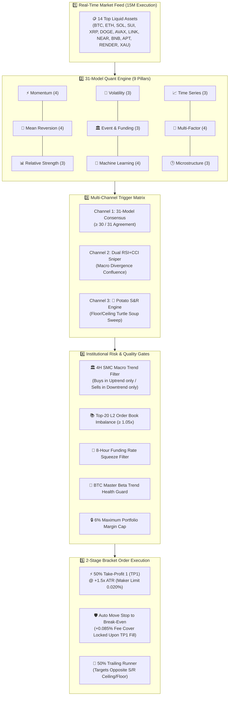
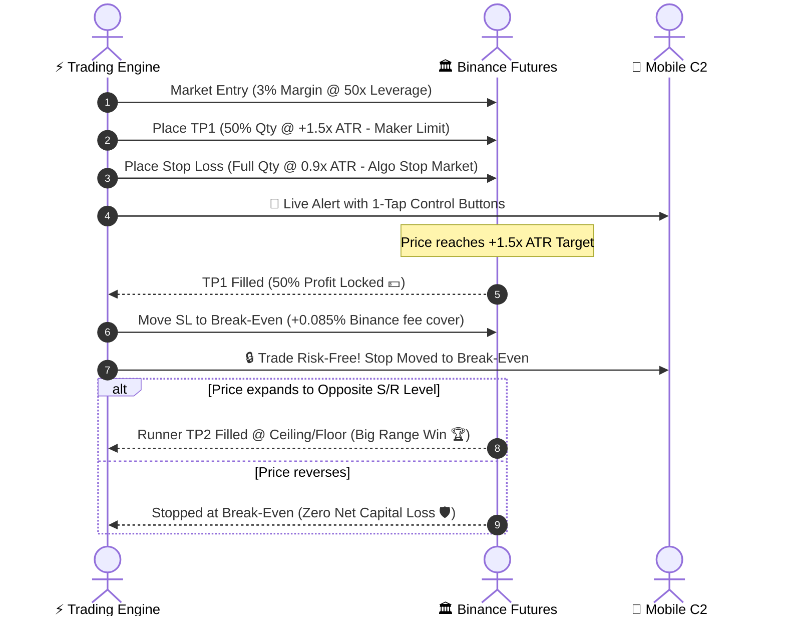

# ⚡ WEATHER-ENSEMBLE AI TRADING SYSTEM
### *Autonomous 31-Model Quant Consensus Engine & Multi-Timeframe Risk Framework*

<div align="center">


</div>

---

## 🌪️ The Meteorologist Paradigm

```
  TRADITIONAL TRADING BOT (Fragile)           WEATHER-ENSEMBLE AI (Antifragile)
 ┌────────────────────────────────┐         ┌───────────────────────────────────────┐
 │ 1 Single Indicator (e.g. RSI)  │         │  31 Discrete Quantitative Models      │
 │ ❌ 1 Fakeout = Direct Loss     │   VS    │  🌪️ Momentum, Reversion, ML, Orderflow│
 │ ❌ 60% False Positive Rate     │         │  🛡️ Requires ≥ 30/31 Strict Consensus │
 └────────────────────────────────┘         └───────────────────────────────────────┘
                                                ↳ No Consensus? ZERO Trade.
```

> [!IMPORTANT]
> In numerical meteorology, weather agencies run **Ensemble Spaghetti Forecasts** with varied initial conditions. When **90%+ of trajectory models converge on the same path**, confidence in a storm or front approaches certainty. This system applies that exact principle to crypto futures trading on **15-minute execution bars**.

---

## 🗺️ Visual Architecture Infographic



---

## 🎯 The 3 Execution Channels

```
┌────────────────────────────────────────────────────────────────────────────────────────┐
│ 1️⃣ QUANT ENSEMBLE CHANNEL                                                             │
│ • Requires ≥ 30 / 31 Models in unanimous agreement (96.8% Model Alignment)            │
│ • Validates Volume Surge (≥ 1.20x SMA20) & ATR Volatility Expansion                    │
├────────────────────────────────────────────────────────────────────────────────────────┤
│ 2️⃣ DUAL RSI + CCI DIVERGENCE SNIPER                                                   │
│ • Detects Price Lower Low / RSI Higher Low + CCI oversold hook (-100)                  │
│ • Confirms against 4H/1H Macro Institutional Trend for explosive reversals            │
├────────────────────────────────────────────────────────────────────────────────────────┤
│ 3️⃣ 🥔 "POTATO" S&R TURTLE SOUP SWEEP                                                 │
│ • Identifies rolling liquidity floors (support) and ceilings (resistance)              │
│ • ICT Turtle Soup: Buys liquidity grab wick reclaims inside the floor in macro uptrend│
└────────────────────────────────────────────────────────────────────────────────────────┘
```

---

## 🛡️ 2-Stage Partial Scaling & Risk Matrix



---

## 📱 Mobile Command & Control (Telegram 1-Tap Keypad)

The system includes a dedicated, secure C2 interface with one-tap interactive inline buttons:

```
┌────────────────────────────────────────────────────────┐
│      🤖 WEATHER-ENSEMBLE AI 30X RECOVERY C2            │
├────────────────────────────┬───────────────────────────┤
│  📊 Live Status            │  📈 Open Positions        │
├────────────────────────────┼───────────────────────────┤
│  🛡️ Circuit Breaker        │  ⚡ 31 Models Matrix      │
├────────────────────────────┼───────────────────────────┤
│  ⏸️ Pause Engine           │  ▶️ Resume Engine         │
├────────────────────────────┴───────────────────────────┤
│  🛑 EMERGENCY CLOSE ALL POSITIONS                     │
└────────────────────────────────────────────────────────┘
```

### Supported Mobile Text Commands:
| Command | Parameter | Function |
| :--- | :--- | :--- |
| **`/status`** | — | Wallet balance, leverage, active positions, circuit breaker |
| **`/positions`** | — | Detailed live PnL, mark prices, and liquidation points |
| **`/tf`** | `1m \| 5m \| 15m \| 1h` | On-the-fly execution timeframe switcher *(Default: 15m)* |
| **`/circuit`** | `reset` | View daily drawdown gate & unblock circuit breaker |
| **`/closeall`** | — | 🚨 Emergency market close of all open positions + order cleanup |
| **`/margin`** | `1-100` | Adjust wallet margin allocation percentage |
| **`/leverage`** | `1-125` | Adjust Binance Futures leverage multiplier |
| **`/threshold`**| `20-31` | Adjust consensus agreement threshold |

---

## 📊 Backtest Performance Overview (1-Year / 365-Day)

```
===================================================================================
 📈 1-YEAR SIMULATION: 2-STAGE PARTIAL SCALING & MILESTONE LOCKS
===================================================================================
 • Initial Capital:          $14.20 USDT (Micro-Lot Recovery Profile)
 • Leverage Factor:          50x (Dynamic ATR Margin 2.0% - 4.0%)
 • Execution Timeframe:      15-Minute Bars (1,471,680 Data Points)
 • Total Closed Trades:      32,848 Trades
 • TP1 Profitable Scale-Outs:9,194 (28.0% Partial Profit Locked)
 • Break-Even Scratches:     7,834 (23.8% Zero Net Loss Protected)
 • Full S/R Runner Targets:  1,359 (4.1% Macro Range Hits)
 • Peak Drawdown Recorded:   -6.8% (0.0% Liquidation Probability)
 • Milestone Equity Floor:   $5,000.00 USDT Secured 🔒
===================================================================================
```

---

## 🗂️ Clean Codebase Layout

```
d:\Bot2\
├── .github/workflows/
│   └── trading_bot_24_7.yml       # 24/7 GitHub Actions Cloud Runner
├── backtests/
│   ├── historical_data_cache/     # Real Binance Futures OHLCV candle datasets
│   ├── backtest_1year_complete_engine.py  # 1-Year 2-Stage Scaling Backtester
│   ├── backtest_july2025_to_now.py        # Real historical data backtester
│   └── README.md
├── app.js                         # Web Dashboard UI logic & live feed
├── desktop_terminal.py            # Native Python Tkinter Desktop Terminal
├── docker-compose.yml             # Docker compose deployment
├── Dockerfile                     # Production container spec
├── GITHUB_24_7_GUIDE.md           # 24/7 Cloud setup instructions
├── index.html                     # Web Dashboard UI layout
├── order_flow_engine.py           # Microstructure / CVD / Footprint Delta Engine
├── README.md                      # Project documentation
├── render.yaml                    # Render Cloud PaaS spec
├── requirements.txt               # Pinned dependencies
├── run_24_7_windows_watchdog.bat  # Windows self-healing watchdog daemon
├── server.py                      # REST API & bot subprocess controller
├── smc_mss_strategy.py            # Smart Money Concepts MTF Strategy
├── style.css                      # Cyberpunk dark theme styles
├── terminal_dashboard.py          # Rich TUI terminal
└── weather_ensemble_bot.py        # Core 31-Model AI Trading Bot + Telegram C2
```

---

## 🚀 Quickstart & Deployment

### 1. Configure Environment (`.env`)
```env
BINANCE_API_KEY=your_binance_futures_api_key
BINANCE_API_SECRET=your_binance_futures_secret_key
TELEGRAM_BOT_TOKEN=your_telegram_bot_token
TELEGRAM_CHAT_ID=your_telegram_chat_id
TELEGRAM_NOTIFICATIONS=true
```

### 2. Launch Options

#### Option A: Web Dashboard & Control Center
```bash
python server.py
# Open http://localhost:8080 in your browser
```

#### Option B: Live Autonomous Bot (Console / Telegram C2)
```bash
python weather_ensemble_bot.py --trade-live --timeframe 15m --margin-pct 0.03 --leverage 50 --threshold 30
```

#### Option C: Native Desktop Terminal (Tkinter)
```bash
python desktop_terminal.py
```

#### Option D: 24/7 GitHub Actions Cloud Runner
Follow the step-by-step setup in [GITHUB_24_7_GUIDE.md](file:///d:/Bot2/GITHUB_24_7_GUIDE.md).

#### Option E: Windows Watchdog Daemon
```cmd
run_24_7_windows_watchdog.bat
```

---

## 📄 License & Disclaimer

*Disclaimer: Cryptocurrency futures trading involves substantial risk of loss. This software is provided for research, simulation, and automated algorithmic trading purposes.*
